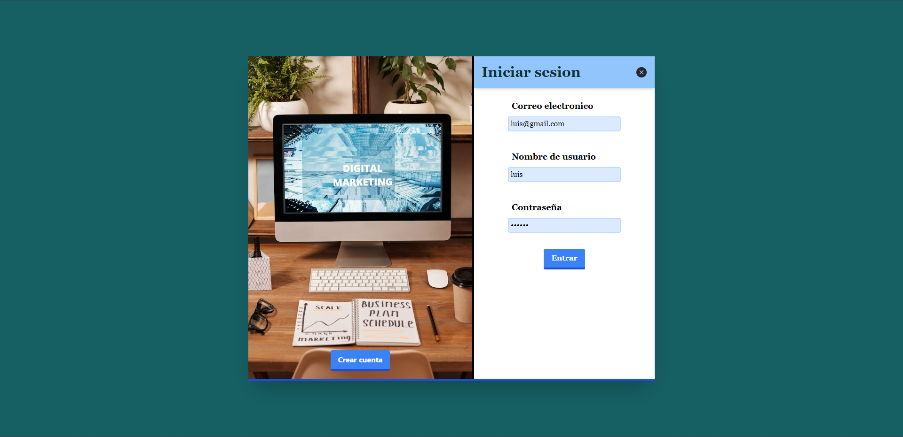
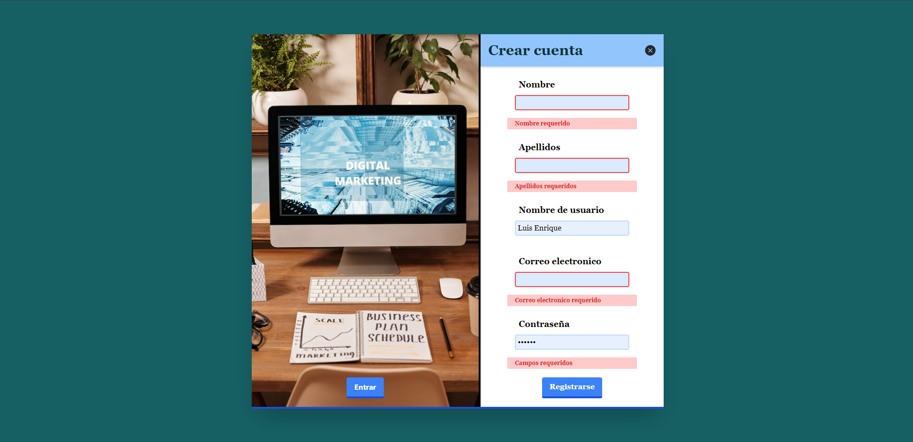

<h1 align='center'>Formulario</h1>

        

        

## Descripcion

proyecto creado en react con typescript, un formulario simple con un Register y un Login, si el usuario no rellena los campos requeridos se le marcaran con una alerta en rojo los campos necesarios para completar, una vez los tenga completos y decide registrarse, el boton cambiara a un spiner que le indica que se estan enviado los datos proporcionados.

## 🖥️ Despliegue

[Prueba este formulario con control de errores al no completar los campos](https://formulario-react-12dcfe.netlify.app/)

## 🚀 Instalación

1. Clona este proyecto.
2. Ve a la carpeta del proyecto
   `formulario`
3. Instala las dependencias
   `npm install` || `npm i`
4. Corre en local
   `npm start`
